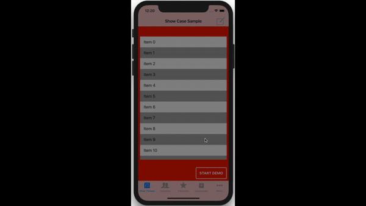

# BubbleShowCase

[](https://github.com/Carthage/Carthage)
[](https://cocoapods.org/pods/BubbleShowCase)
[](https://cocoapods.org/pods/BubbleShowCase)
[](https://opensource.org/licenses/MIT)
<!-- [](https://cocoapods.org/pods/BubbleShowCase)
[](https://cocoapods.org/pods/BubbleShowCase) -->

BubbleShowCase is an elegant and easy to use framework that provides developers with a user-friendly buble-like view you can display to help your users understand your App features, improve the use of some functionality or display your App onboarding. It consists of a translucent view that obscures the screen, a bubble that displays the message for your user and the targeted view itself.



## Requirement
* iOS 9.0+
* Swift 4.0+

## Installation

### CocoaPods
```
pod 'BubbleShowCase'
```

### Carthage
To integrate BubbleShowCase into your Xcode project using Carthage, create a `Cartfile` and add:
```ogdl
github "ECLaboratorio/BubbleShowCase-iOS"
```

You can install Carthage with [Homebrew](http://brew.sh/) using the following command:
```bash
$ brew update
$ brew install carthage
```

If you don't have know what *HomeBrew* is, check their [site](https://brew.sh/) for installation instructions.

## Usage

### Basic

It's pretty simple to show-case a feature in your App by using BubbleShowCase framework. All you have to do is initializing a show case by using one of its constructors, customizing it the way you want and calling its `show` method:
```swift
let showCase: BubbleShowCase! = BubbleShowCase(target: myBarButton)
showCase.titleText = "You know what?"
showCase.descriptionText = "You can do amazing things if you tap on this navbar button"
showCase.image = UIImage(named: "show-case-bar-button")
showCase.show()		// Simple as that
```

**Note:** You should call `show` when the target is loaded, set and positioned in the screen.

### Supported targets
- UIView
- UITableView
- UICollectionView
- UIBarButtonItem
- UITabBarItem

### UICollectionViewCell and UITableViewCell

BubbleShowCase offers several constructors depending on the targets. Use the specific constructor in case of UITableViewCell or UICollectionViewCell:
```swift
func tableView(_ tableView: UITableView, willDisplay cell: UITableViewCell, forRowAt indexPath: IndexPath) {
	if indexPath.row == Constants.IndexPathForShowCase {
		let showCase = BubbleShowCase(cell: cell, target: nil, arrowDirection: .down)
		showCase.titleText = "Am I not in the screen?"
		showCase.descriptionText = "I'll stop the scroll and make sure the cell displays"
		showCase.shadowColor = UIColor.green
		
		showCase.show()
	}
}
```

### UI Customization

Customize your show cases according to your App style:
```
showCase.color = UIColor.yellow
showCase.textColor = UIColor.black
showCase.shadowColor = UIColor.black
showCase.crossColor = UIColor.red
showCase.arrowDirection = .up
showCase.titleText = "My first show case"
showCase.descriptionText = "I hope you enjoy it"
showCase.image = UIImage(named: "my-show-case-image")
showCase.delegate = self
showCase.titleFont = UIFont(name: "Roboto-Bold", size: 14)!
showCase.descriptionFont = UIFont(name: "Roboto-Regular", size: 13)!

showCase.showAnimationDuration = 0.2
showCase.dismissAnimationDuration = 0.2
showCase.flickerAnimationDuration = 0.2

// Use this to force your users to tap or perform any other gesture over the target view
showCase.isCrossDismissable = false	
```


### Concatenating show cases

Do you need to show-case several features one after another? That's easy, you just have to call `concat(bubbleShowCase:)` or `show(after:)`. The former concatenates the argument as the next show case to show whereas the latter displays the show case after the argument:
```swift
let firstShowCase = BubbleShowCase(...)
let secondShowCase = BubbleShowCase(...)

firstShowCase.concat(bubbleShowCase: secondShowCase)	// secondShowCase.show(after: firstShowCase)
```

### BubbleShowCaseDelegate

Conform to BubbleShowCaseDelegate to be aware of the show case status in the screen or to be notified of common gestures recognized over the target:
```
let showCase = BubbleShowCase(...)
showCase.delegate = self

...
...

func bubbleShowCase(_ bubbleShowCase: BubbleShowCase, didTap target: UIView!, gestureRecognizer: UITapGestureRecognizer) {
	print("Target was tapped!")
}

```

**Note:** In order to show-case a UIBarButton, this must be constructed by means of a custom view:
```swift
let myBarButton = UIBarButtonItem(customView: myCustomView)
let showCase: BubbleShowCase! = BubbleShowCase(target: myBarButton)
...
showCase.show()
```

For more information, please check our [sample app](/Sample).

If you have any issues or feedback, please visit [issue section](https://github.com/ECLaboratorio/BubbleShowCase-iOS/issues).  
Please feel free to collaborate make this framework better. 

## License  

`BubbleShowCase-iOS` is available under the MIT license. See the [LICENSE](/LICENSE) file for more info.
